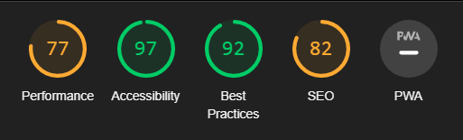

<h1 style="text-align: center;"><strong>TESTING</strong></h1>
<h2 style="text-align: center;"><strong>The Space Bar</strong></h2>
<h2 style="text-align: center;">Code Instititute Milestone Project 1</h2>

---

## **Programs Used**
---
1. [W3C Markup Validation Service:](https://validator.w3.org/)
      * W3C Validation was used to validate all html5 code to conform to industry standards.
2. [W3C CSS Validation Service:](https://jigsaw.w3.org/css-validator/)
      * W3C Validation was used to validate all CSS3 code to conform to industry standards.
3. [Google Lighthouse](https://developer.chrome.com/docs/lighthouse/overview/)
      * Google Lighthouse was used to check site wide functionality.
4. [Imagify | Optimization:](https://app.imagify.io/?status=success&utm_source=email_confirmation&utm_medium=email&utm_campaign=account_confirmation)
      * Imagify was used to further reduce the file size of images on the website.
5. [similarweb](https://www.similarweb.com/browsers/)
      * Similarweb was used to find out the most popular browsers for March 2023

---

# AUTOMATED TESTING

## **Code Validation/Bug Fixes**
---
### index.html
  | <span style="color: DarkRed;">ERRORS</span> | 
  |:------:|
  |4       |
1. **Error**: Bad value home for attribute aria-current on element a

       - Removed aria-current from a element.
  
2. **Error**: The element button must not appear as a descendant of the a element.

       - Removed button element from a element and styled a element to function as a button.
    

       - Added class to tripadvisor a element to maintain transition effect.
    

3. **Error**: Attribute target not allowed on element iframe at this point.
  
       - Removed taget attribute from iframe element.
  
4. **Error**: Bad value No for attribute allowfullscreen on element iframe.

       - Changed allowfullscreen="no" to allow="fullscreen".


---
### activities.html
  | <span style="color: DarkRed;">ERRORS</span> | 
  |:------:|
  |1       |
1. **Error**: The element button must not appear as a descendant of the a element.

       - Removed button element from a element and styled a element to function as a button.
       
    - BEFORE  
    

    - AFTER  
    


---
### contactus.html
  | <span style="color: yellow;">WARNINGS</span> | 
  |:------:|
  |1       |
1. **Warning**: Section lacks heading. Consider using h2-h6 elements to add identifying headings to all sections, or else use a div element instead for any cases where no heading is needed.

       - Deleted page section and replaced with a div element.


---
### rooms.html | 404.html | formconfirmation.html
  | <span style="color: DarkRed;">ERRORS</span> | 
  |:------:|
  |NIL     |


---
### style.css
  | <span style="color: DarkRed;">ERRORS</span> | 
  |:------:|
  |NIL     |


---

## **Performance**
---
Google Lighthouse was used to test every page on the site on **Mobile** & **Desktop**. Below are screen shots of each summary before and after changes were made.

### **index.html (MOBILE)**

| BEFORE        | AFTER         | 
|:-------------:|:-------------:| 
|      ||  

### **index.html (DESKTOP)**

| BEFORE        | AFTER         | 
|:-------------:|:-------------:| 
|      ||

---  

### **activities.html (MOBILE)**

| BEFORE        | AFTER         | 
|:-------------:|:-------------:| 
|      ||


### **activities.html (DESKTOP)**

| BEFORE        | AFTER         | 
|:-------------:|:-------------:| 
|      ||

---

### **contactus.html (MOBILE)**

| BEFORE        | AFTER         | 
|:-------------:|:-------------:| 
|      ||

### **contactus.html (DESKTOP)**

| BEFORE        | AFTER         | 
|:-------------:|:-------------:| 
|      ||

---

## **Main Google Lighthouse Issues**
---
### **issue #1 (PERFORMANCE)** 


GLH flagged up issues with the file size of my site images, i had taken measures to avoid this in my original development process by resizing images to fit their purpose.  
however i realised that by uploading my images to **_Imagifiy_** i could reduce the file size even more.  

This cut the file size of my images by **over 50%** with the intention of increasing site wide performance.
| BEFORE        | AFTER         | 
|:-------------:|:-------------:| 
|      || 

The Background image was exceptionally large compared to all other images on the site, however **_Imagify_** would not allow me to reduce the file size so i did this manually on my computer.  
As you can see from the screen shot below the reduction in file size after conversion is substantial.  


---

### **issue #2 (ACCESSABILITY)**

GLH flagged up that several elements on my website did not have descriptive link text. My **Contact us** button on index.html and the **Home** button on formconfirmation.html were the 2 links identified.  
This was solved by adding an **aria-label** to each a element.
```html
<a href="activities.html" class="btn-cta-home" aria-label="button to activities page">MORE INFO</a>
```
```html
<a href="index.html" class="btn-form-confirmation" aria-label="button to home page">Home</a>
```
---

### **issue #3 (SEO)**

GLH flagged up that meta tags were missing from the website and adding them would improve the sites overall SEO. I decided to add these to 2 of the content heavy pages on the site. These are **index.html** & **activities.html**  
Below are the 2 meta tags added to each page:  
**index.html**
```html
<meta name="keywords" content="Video-Games, Cocktails, Food">
<meta name="description" content="Quality Food & Entertainment">
```
**activities.html**
```html
<meta name="keywords" content="Video-Games, Cocktails, Food, Events">
<meta name="description" content="We offer a vast choice of activities to keep you entertained.">
```
--- 

## **Contrast**
---
GLH did not flag any issues with the contrast ratio of my website, Text is clear to read and easy on the eye. I did add an underlay to the text on **activities.html** as the image behind was obscuring certain parts of the text.

---  

# MANUAL TESTING

## **User Experience (UX)**
---
  * ## **User Stories**
    * ### **Potential New Customer**
        1. As a Potential New Customer visiting the site i am looking for information about the business.  
           
           _-On arrival to the site users are shown **headings** and small **descriptions** of what the business is._
        
        2. As a Potential New Customer visiting the site i am looking for information about what the business has to offer customers who visit the premises.  
           
           _-Clicking the **CTA button** under the heading will take users to the activities section of the website that containes a detailed description  
            of everything the business has to offer._
        
        3. As a Potential New Customer i want all relevant information to be easily found through simple navigation links.  
           
           _-At the top of every page is a clean and simple **navigation bar** with information displayed in order of relevance guiding the user  
      to other pages of the website._  
           
           _-On the Activities page there is also an in page naviagtion bar for the user to jump to their desired section with ease._
 
    * ### **Returning Customer**
        1. As a returning Customer to the site i want to see if any new developments have happened within the business.
                  
           _-Users can access **social media accounts** related to the business at the bottom of every page to keep up to date._
        
        2. As a returning Customer to the site i want to be able to contact the owners of the business.

           _-Buttons on the **activities page** are all linked to the **contact us page** to encourage users to get in touch with the business._  
           
           _-Users can contact the business through the **"contact us"** page with a form which gives the option to choose the reason for contact._
    
    * ### **Business Owner Goals**
        1. As The Business owner i want to convey the style and personality of my business through the website.

            _-The entire sites style is consistent throughout. Text entrys have a **sense of humour** and **welcoming vibe** to them,  
            with the aim of making users feel that any request they may have is possible._
        
        2. As the Business owner i want to provide my customers with relevant inforamtion about the business.

            _-There are multiple options for users to obtain information relevant to them. The home page has, **headings** with a small **descriptions**  
            a **Google map** showing the business location, **customer reviews** and a link to **tripadvisor**.  
            The **Activities** page has a detailed list of everything that is available at the business as well as multpiple **CTA buttons**._

        3. As the Business owner i want to provide means of contacting the premises through the website.

            _-A Footer is present on every page with links to **social media accounts** related to the business._

            _-Contact us page complete with a **form** to contact the business directly for any reason._ 

---

## **Browser Compatability**
---
A list of the most popular browsers used in March 2023 was used to decide which browsers to test the website on. In order to test on Safari i accessed the website from my personal phone.


|BROWSER|LAYOUT MAINTAINED|EFFECTS MAINTAINED|COMPATABLE|
|:-----:|:---------------:|:----------------:|:--------:|
|CHROME|YES|YES|YES|
|FIREFOX|YES|YES|YES|
|EDGE|YES|YES|YES|
|OPERA|YES|YES|YES|
|SAFARI|YES|YES|YES|

## **Device Compatability**
---
|DEVICE|BUGS/ISSUES|
|:-----:|:---------------:|
|KINDLE FIRE|ICON OUT OF LINE|
|IPAD AIR|ICON OUT OF LINE|
|SURFACE PRO 7|ICON OUT OF LINE|
|NEST HUB|NONE|
|IPHONE 12|LAYOUT OUT OF LINE|
|SAMSUNG S20 ULTRA|LAYOUT OUT OF LINE|

## **Bugs/Issues**
---

### **index.html**

After testing my website on multiple devices through Google dev tools i have discovered that any screen size under 446 pixels causes several elements on my page to not display as intended.  
Example of the error below:


In order to fix this i created the following section of code to reduce font-size for both elements.
```css
@media (max-width: 446px) {

    .navbar-toggler,
    .navbar-brand {
        font-size: calc(.8rem + .9vw);
    }

}
```
The layout is now as intended to a minimum screen size of 350 pixels, in future i would add another media query to make the site responsive on extra small devices. 


### **activities.html**

Device testing on small devices also created a layout issue on the activities page.  
Example of the error below:


In order to fix this i created the following section of code to increase section size and reduce the font size of the buttons on small devices.
```css
  @media (max-width: 446px) {
    .btn-cta-activities {
        font-size: .8rem;
    }
     
    #space-bar,
    #video-games,
    #events,
    #food {
        height: 800px;
    }
  }
```


## **Deployment**
---


 
